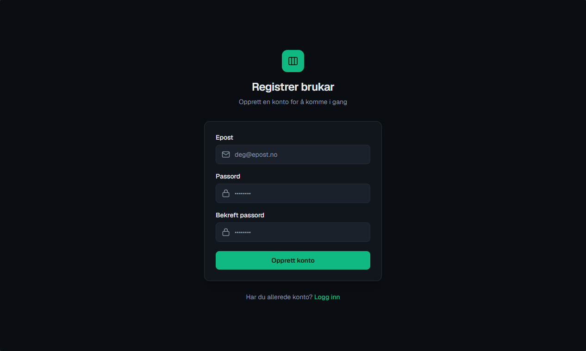
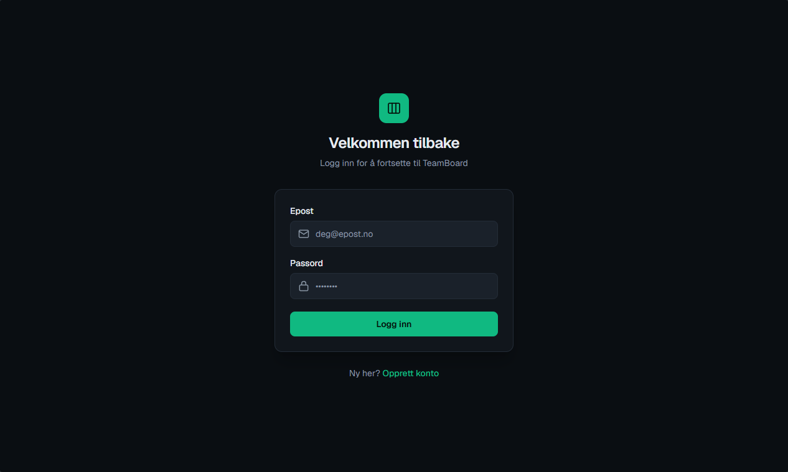
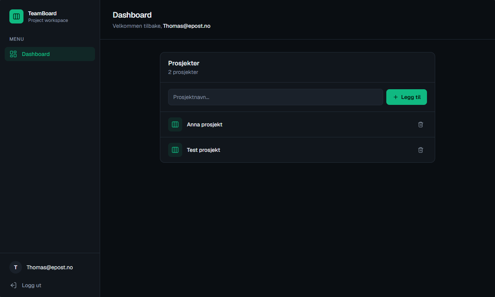
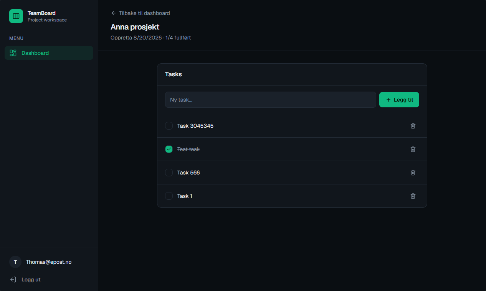

# TeamBoard

> Prosjektet er under utvikling.

TeamBoard er eit Mini-SaaS-demoprosjekt for organisering av prosjekt og oppgåver. Prosjektet er bygd som eit monorepo med ASP.NET Core Web API på backenden og Next.js, React og TypeScript på frontenden.

Målet er å demonstrere ein moderne og relevant fullstack-arkitektur med autentisering, tilgangskontroll, databaseintegrasjon, API-kommunikasjon og eit responsivt brukargrensesnitt.

## Skjermbilete

### Registrering



### Innlogging



### Dashboard



### Prosjekt og oppgåver



## Funksjonalitet

- Registrering og innlogging med ASP.NET Core Identity
- Autentisering med bearer-token
- Beskytta sider og API-endepunkt
- Prosjekt knytte til den innlogga brukaren
- Opprette, vise og slette prosjekt
- Opprette og slette oppgåver i eit prosjekt
- Markere oppgåver som fullførte eller ikkje fullførte
- Dashboard med oversikt over eigne prosjekt
- Persistent SQLite-database i lokalt utviklingsmiljø
- Responsivt brukargrensesnitt med felles navigasjon og tilbakemelding ved lasting og feil

## Teknologistakk

### Backend

- .NET 10
- ASP.NET Core Web API
- ASP.NET Core Identity
- Entity Framework Core
- SQLite
- Minimal APIs
- Swagger/OpenAPI i utviklingsmiljø

### Frontend

- Next.js 16 med App Router
- React 19
- TypeScript
- Tailwind CSS 4

### Utvikling og drift

- Docker
- Docker Compose
- Git-monorepo

## Prosjektstruktur

```text
teamboard-monorepo/
├── backend/
│   └── TeamBoard.Api/       # ASP.NET Core API, datamodellar og migrasjonar
├── frontend/                # Next.js-applikasjon
│   ├── app/                 # Sider og ruter med App Router
│   ├── components/          # Delte React-komponentar
│   └── lib/                 # API-klient
├── docs/
│   └── screenshots/         # Skjermbilete brukt i README
├── docker-compose.yml
└── README.md
```

## Køyr prosjektet lokalt

### Føresetnader

- Docker Desktop må vere installert og starta.

### Start applikasjonen

Køyr denne kommandoen frå rotmappa i prosjektet:

```bash
docker compose up --build
```

Den første oppstarten kan ta litt tid fordi Docker må laste ned og byggje nødvendige image.

Når begge tenestene er starta, er dei tilgjengelege her:

- Frontend: <http://localhost:3000>
- Backend/API: <http://localhost:5018>
- Helsesjekk: <http://localhost:5018/health>

Stopp tenestene med `Ctrl+C`. Fjern deretter containerane med:

```bash
docker compose down
```

SQLite-databasen blir lagra lokalt i `backend/TeamBoard.Api/teamboard.db` og blir ikkje sletta av `docker compose down`.

## Aktuelle ruter

- `/register` – opprett brukar
- `/login` – logg inn
- `/dashboard` – vis og administrer prosjekt
- `/projects/{id}` – vis prosjektet og administrer oppgåver

## Vidare planar

- Redigering av prosjekt og oppgåver
- Prosjektmedlemmer og invitasjonar
- Roller og meir detaljert tilgangskontroll
- Oppgåvestatus, prioritet, frist og ansvarleg brukar
- Søk, filtrering og sortering
- Automatiserte testar
- Produksjonsdeploy av frontend og backend

## Status

TeamBoard er eit portefølje- og læringsprosjekt under aktiv utvikling. Funksjonalitet og arkitektur kan derfor bli endra etter kvart som prosjektet blir vidareutvikla.
